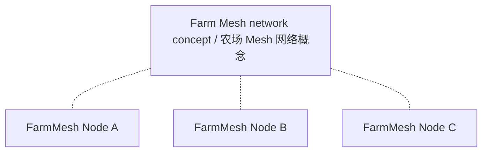
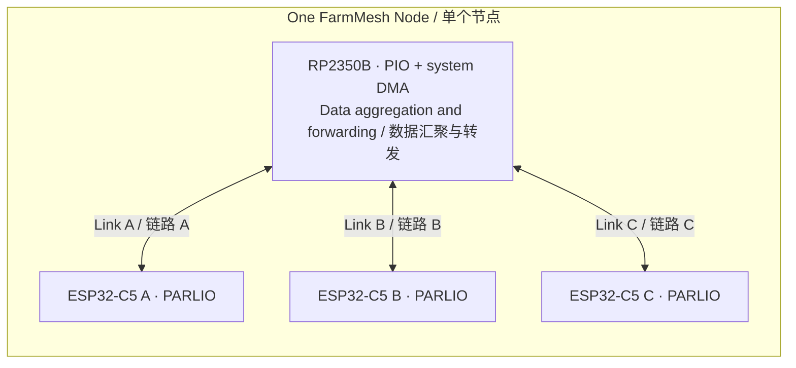

# FarmMesh Node

**Draft v0.1 — hardware architecture discussion**

English | [简体中文](README.zh-CN.md)

[Overview](#overview) · [Architecture](#architecture) · [Internal interface](#candidate-internal-interface) · [Open decisions](#open-decisions) · [Roadmap](#roadmap) · [References](#references)

## Overview

FarmMesh Node is a hardware node project for a Mesh network intended for large-area farm deployments. Each node contains **one RP2350B and three ESP32-C5 chips**. Multiple nodes form the intended network; the three internal links are one part of the node, not the definition of the whole project.

The RP2350B is intended to aggregate and forward data inside each node. Each ESP32-C5 has an independent internal link to the RP2350B, with a **50 Mbps (megabits per second) target per link**. This is not a shared 50 Mbps budget. Whether that target applies to one direction, the sum of both directions, or each direction remains undecided. It does not specify actual wireless throughput.

The project follows a **hardware-first, software-later** sequence. This repository currently records the architecture draft. Schematics, PCB layout, interface programs and timing validation have not been completed, and sustained 50 Mbps operation has not been demonstrated.

## Architecture

### Network concept

The dotted lines below indicate participation in the intended network, not specific radio links or a central network device. Inter-node topology, radio roles and Mesh protocol remain open.

### Inside one node

Each line represents an independent internal data link. Clock and VALID directions are defined separately in the interface table below; the arrows here do not specify clock sources.

The three ESP32-C5 chips' wireless roles, channels and connections to other nodes are not assigned by this diagram.

## Candidate internal interface

The current candidate is **ESP32-C5 PARLIO ↔ RP2350 PIO**, using separate 4-bit TX and RX data buses. It is a candidate for concurrent bidirectional operation, not a frozen or validated implementation.

**Each C5 supplies both clocks. The RP2350 PIO follows an external clock in both directions**, including when the RP2350 sends data to the C5.

| Transfer direction | DATA | Clock | VALID |
| --- | --- | --- | --- |
| C5 → RP2350 | 4 signals, C5 → RP | C5 TX CLK → RP | C5 TX VALID → RP |
| RP2350 → C5 | 4 signals, RP → C5 | C5 RX CLK → RP | RP VALID → C5 |

This uses **12 signals per link**: 8 DATA, 2 CLK and 2 VALID. Three links use **36 signals**, plus a common ground reference. No final pin assignment is established.

PARLIO has separate TX and RX units. A shared-data, half-duplex alternative would require explicit output-enable, tri-state and direction-change handling. PARLIO must not be treated as an automatically reversing shared bus, and disabling TX does not by itself establish a high-impedance output.

### Preliminary resource budget

| RP2350B resource | Available | Initial three-link estimate |
| --- | --- | --- |
| Bank0 GPIO, QFN80 package | 48 | 36 interface signals; 12 remain before other allocations |
| PIO state machines | 12 across 3 PIO blocks | 6: one RX and one TX per link |
| System DMA channels | 16 | 6: one per direction per link |
| PIO instruction memory | 32 shared instructions per PIO block | Program size not yet established |

These estimates do not constitute an implemented PIO program or validated timing design. Each PIO has a 32-GPIO window selected by GPIOBASE 0 or 16; the eventual mapping and instruction use must be checked. Dedicated QSPI storage pins, USB and SWD do not consume the 48 Bank0 GPIOs. Board-level availability must be checked separately. The 30-GPIO RP2350A cannot accommodate this 36-signal candidate.

### Processing responsibilities and timing boundary

- **CPU:** initialization, buffer preparation, transaction coordination and exception handling.
- **PIO:** beat-level sampling and output timing under the C5-provided clocks.
- **System DMA:** block transfers between PIO FIFOs and RP2350 SRAM, intended to avoid CPU byte-by-byte copying.

The C5 PARLIO RX documentation describes receive-clock output and VALID-based reception gating. C5 RX/GDMA transactions must be prepared before data arrives; VALID alone does not create a receive transaction. The RP must prepare the first beat and drive VALID correctly. Start/end behavior, sampling edges and gating timing still require a concrete design and validation.

Frame boundaries, DMA rearming and sustained operation also remain to be designed. A ring-address setting alone is not a guarantee of indefinite operation, and this draft does not claim CPU-free transfer management.

## Open decisions

1. Define the directional meaning of the per-link 50 Mbps target.
2. Establish three-link PIO feasibility, clock/timing constraints, GPIO mapping, instruction budget and required CPU participation.
3. Define first-beat readiness, VALID behavior, receive-transaction preparation, frame boundaries and DMA rearming.
4. Later, decide radio roles/channels, Mesh protocol and routing, antennas, coverage targets, power supply, environmental protection and the full BOM.

The immediate discussion is limited to hardware interface feasibility and the division of work among PIO, system DMA and CPU. Wireless throughput and software routing are later topics.

## Roadmap

| Phase | Scope | Status |
| --- | --- | --- |
| 1 | Confirm hardware interfaces and architecture | Current: discussion draft |
| 2 | Schematics and PCB layout | Pending architecture decisions |
| 3 | Bring-up and interface validation | Pending hardware; includes necessary test firmware |
| 4 | Application firmware and Mesh integration | After hardware validation |

## References

Official sources for subsequent design checks:

- [RP2350 datasheet](https://datasheets.raspberrypi.com/rp2350/rp2350-datasheet.pdf) — GPIO, PIO and system DMA resources.
- [ESP32-C5 datasheet](https://documentation.espressif.com/esp32-c5_datasheet_en.html) and [technical reference manual](https://documentation.espressif.com/esp32-c5_technical_reference_manual_en.pdf) — device and peripheral details.
- [ESP32-C5 PARLIO RX driver](https://docs.espressif.com/projects/esp-idf/en/stable/esp32c5/api-reference/peripherals/parlio/parlio_rx.html) — receive clock, VALID and transaction setup.
- [ESP32-C5 PARLIO TX driver](https://docs.espressif.com/projects/esp-idf/en/stable/esp32c5/api-reference/peripherals/parlio/parlio_tx.html) — transmit configuration and operation.

Differences in maximum full-duplex width descriptions across C5 documentation still need reconciliation. This draft considers only the 4-bit-per-direction candidate and makes no claim about wider full-duplex configurations. The ESP-IDF `stable` links can change; record the selected SDK and document versions when the implementation baseline is set.
