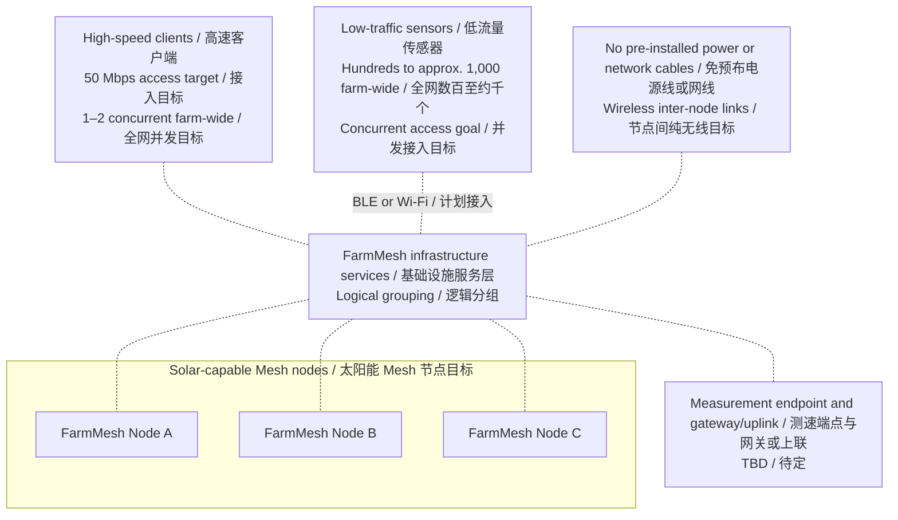
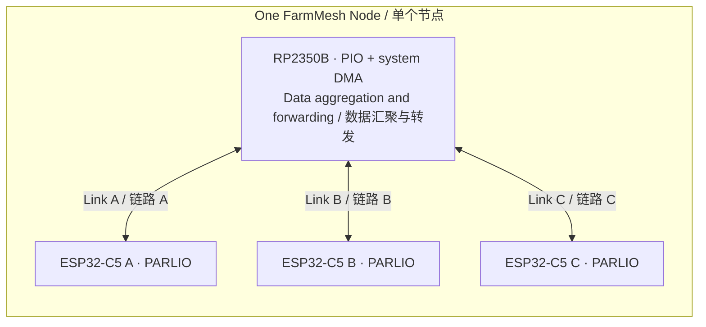

# FarmMesh Node

**A1 hardware prototype — product goals, PCB and first-board validation plan**

English | [简体中文](README.zh-CN.md)

[Overview](#overview) · [A1 hardware](#a1-hardware-prototype) · [Features & targets](#key-features-and-performance-targets) · [Architecture](#architecture) · [Internal interface](#candidate-internal-interface) · [Wireless research](#wireless-research-status) · [Open decisions](#open-decisions) · [Roadmap](#roadmap) · [Contact](#contact-and-participation) · [References](#references)

## Overview

FarmMesh Node aims to provide **farm-wide coverage using solar-powered infrastructure nodes that need no pre-installed power or network cabling**, combining on-demand high-speed client access with distributed access for hundreds to approximately 1,000 low-traffic sensors. Inter-node links are intended to be entirely wireless. Solar supply, storage and node power budgets remain to be designed; this is not a claim of all-weather energy autonomy, and a gateway/uplink may still be needed.

The client-access design target is **50 Mbps of effective throughput after connecting to a Mesh node**, available on demand wherever needed in the farm. The initial capacity assumption is **1–2 concurrent high-speed clients across the whole farm**, not per infrastructure node and not a limit on the number of Mesh nodes or total clients. This does not require every location to receive 50 Mbps simultaneously. Measurement endpoints, direction and test conditions remain TBD; there is no guarantee of 50 Mbps across multiple Mesh hops or to the Internet.

Infrastructure nodes are intended to provide **concurrent BLE or Wi-Fi access for several hundred to approximately 1,000 low-traffic, low-power sensors across the whole farm**, distributed among multiple Mesh nodes. This is an aggregate planning target requiring capacity validation, not 1,000 direct BLE connections per node or simultaneous packet transmission by every sensor. End-device energy requirements and the infrastructure's solar-power budget are separate concerns; neither implies that the forwarding infrastructure must sleep. Low Wi-Fi traffic alone does not establish low power consumption, and BLE/Wi-Fi coexistence requires validation.

Each infrastructure node contains **one RP2350B and three ESP32-C5 chips**, implemented in A1 with three official **ESP32-C5-WROOM-1U-N8R8 modules**. The RP2350B is intended to aggregate and forward data inside the node, with an independent internal link to each C5. The separate preliminary **50 Mbps per internal link** target is a hardware design input, not a demonstrated user throughput figure or proof that the access-service target can be met. Its directional and raw-rate/payload-rate definitions remain TBD.

The project follows a **hardware-first, software-later** sequence. The **A1 prototype has eight schematic sheets and a four-layer PCB**; the current fabrication gate is recorded in [RELEASE.md](hardware/rev-a/RELEASE.md). Firmware, interface timing and physical performance validation remain unfinished. Coverage, user throughput, terminal capacity, power consumption and sustained internal-link performance have not been measured.

## A1 hardware prototype

A1 contains a 100 × 100 mm four-layer PCB, protected single-cell nominal 3.7 V Li-ion input, 3.3 V buck-boost supply, RP2350B, three C5 modules, independent parallel interfaces, UART download headers and RP USB/SWD. USB data disconnects in hardware when VBUS is absent, including ROM BOOTSEL operation. USB does not power or charge the board. Solar charging and storage sizing remain separate design work.

| Artifact | Use and status |
| --- | --- |
| [Release status](hardware/rev-a/RELEASE.md) | Authoritative prototype fabrication gate and validation boundaries |
| [Manufacturing ZIP](hardware/rev-a/FarmMesh-Node-A1-manufacturing.zip) / [SHA-256](hardware/rev-a/FarmMesh-Node-A1-manufacturing.zip.sha256) | Released for controlled A1 prototypes: Gerber, drills, BOM, placements, drawings, editable source and review evidence |
| [KiCad project](hardware/rev-a/FarmMesh-Node.kicad_pro) / [PCB](hardware/rev-a/FarmMesh-Node.kicad_pcb) | Editable native sources; download the repository together with project-local libraries |
| [Eight-page schematic PDF](hardware/rev-a/review/FarmMesh-Node-A1.pdf) | A1 circuit review copy |
| [Manufacturing instructions](hardware/rev-a/FABRICATION.md) / [parts selection](hardware/rev-a/parts-selection.json) | Stackup, assembly requirements, 153 selected assembly parts and accessories |
| [First-board test plan](hardware/rev-a/FIRST-BOARD-TEST.md) | Staged power, debug, USB, thermal, load and RF checks; results are not yet measured |
| [Design notes](hardware/rev-a/DESIGN-NOTES.md) | Circuit and layout choices, sources and reproducibility |
| [Power review](hardware/rev-a/reports/a1-power-review.md) / [RF and digital review](hardware/rev-a/reports/a1-rf-digital-review.md) / [DFM and BOM review](hardware/rev-a/reports/a1-dfm-bom-review.md) | Independent engineering review records, with remaining bench-validation boundaries |

The C5 modules use external dual-band antennas. Their native USB pins are allocated to PARLIO; each C5 retains UART download and logging. **No wireless transport or Mesh protocol is selected by the hardware.** A fabrication-ready package does not establish RF, power or throughput performance.

## Key features and performance targets

**Targets below are planned requirements, not measured results.** TBD means to be determined. Chip resource facts and candidate allocations are identified separately.

| Item | Target or configuration | Status and boundaries |
| --- | --- | --- |
| Solar power and deployment | Solar-capable infrastructure nodes; no pre-installed power or network cables; wireless inter-node links | Design goal; solar sizing, storage and node power budget TBD; energy autonomy unverified; gateway/uplink architecture open |
| Farm-wide coverage | Wireless access throughout the farm | Product goal; area, terrain, range, node count and placement TBD |
| On-demand high-speed access | 50 Mbps effective client-access throughput after connecting to a Mesh node | Design goal; measurement endpoints, direction and conditions TBD; no multi-hop or Internet throughput guarantee |
| High-speed client concurrency | Initially 1–2 across the whole farm | Capacity assumption, unverified; not per Mesh node, a Mesh-node count limit or a total-client limit |
| Concurrent low-traffic access | Several hundred to approximately 1,000 sensors across the farm via BLE or Wi-Fi | Aggregate planning target, distributed across nodes; capacity has an upper bound and needs validation; not per-node BLE sessions or simultaneous packets from all sensors |
| Per-node BLE capacity | Bounded by C5 controller, host stack/configuration and radio scheduling | Connection-based versus advertising/scanning mode TBD; role and per-node limits unconfirmed; three C5 capacities cannot simply be added into a guarantee |
| End-device energy use | Support low-power terminal operation | Product goal; activity duty cycle, power budget and battery-life target TBD; solar infrastructure budget separately TBD |
| Node composition | 1 × RP2350B + 3 × ESP32-C5-WROOM-1U-N8R8 | Selected A1 architecture; physical validation pending |
| A1 hardware artifacts | Eight-sheet KiCad schematic, four-layer PCB and selected BOM; nominal 3.7 V single-cell Li-ion input | Fabrication gate in RELEASE.md; solar charging, firmware and physical validation remain separate |
| Independent internal links | Preliminary target: 50 Mbps per C5–RP2350 link, not shared across three links | Internal-interface target; direction, raw versus payload rate and required margin for the user-service target TBD; unverified |
| Internal interface | PARLIO ↔ PIO, separate 4-bit TX/RX buses; both clocks supplied by C5 | Candidate; 12 signals per link; A1 pin assignment drawn and reviewed; programs and timing unverified |
| RP2350B resources | 48 Bank0 GPIOs; 3 PIO blocks / 12 state machines; 32 shared instructions per block; 16 system DMA channels | Chip resource facts; preliminary interface allocation below is not implementation proof |
| Wireless roles and interconnection | Three C5 chips per node; Mesh protocol, radio roles/channels and gateway/uplink TBD | Architecture decisions pending; no guaranteed BLE/Wi-Fi coexistence performance or Internet throughput |

## Architecture

### Network concept

The diagram separates end-device access from the Mesh infrastructure. Dotted lines show intended service relationships and node membership, not physical radio links or packet paths. The service box is a logical grouping, not a central device. Inter-node topology, radio roles and Mesh protocol remain open; the measurement endpoint and gateway/uplink boundary are also TBD.

### Inside one node

Each line represents an independent internal data link. Clock and VALID directions are defined separately in the interface table below; the arrows here do not specify clock sources.

The three ESP32-C5 chips' wireless roles, channels and connections to other nodes are not assigned by this diagram.

### Wireless coexistence boundary

Espressif documents shared RF resources with time-division and priority arbitration. Its current C5 coexistence table marks Wi-Fi SoftAP Connecting/Connected combined with BLE Scan/Advertising/Connected as C1 (supported, with unstable performance). This is a constraint to validate if a C5 is assigned both Wi-Fi AP and BLE roles; it does not establish that the three-chip node cannot meet its goals. Radio-role allocation and coexistence must be checked against the selected SDK and operating scenarios. Concurrent terminal service does not imply independent, simultaneous full-load radios on a single C5. See the [official RF coexistence guide](https://docs.espressif.com/projects/esp-idf/en/stable/esp32c5/api-guides/coexist.html#supported-coexistence-scenario-for-esp32-c5).

Per-node BLE capacity has an implementation-dependent limit, not one universal fixed connection count imposed by the BLE specification. The C5 controller and NimBLE host expose separate connection-limit settings in the [official configuration reference](https://docs.espressif.com/projects/esp-idf/en/stable/esp32c5/api-reference/kconfig-reference.html#config-bt-le-max-connections). Connection-based access and connectionless advertising/scanning are different [BLE roles and topologies](https://docs.espressif.com/projects/esp-idf/en/stable/esp32c5/api-guides/ble/get-started/ble-introduction.html#bluetooth-le-network-topology); scanning advertisements must not be counted as persistent connections. Advertising/scanning terminal capacity needs its own validation. Select the access mode and three C5 roles before confirming per-node capacity; simply adding three chip-level limits does not establish node capacity.

## Candidate internal interface

The selected hardware interface is **ESP32-C5 PARLIO ↔ RP2350 PIO**, using separate 4-bit TX and RX data buses. A1 freezes the physical connections; firmware and timing for concurrent bidirectional operation remain unvalidated.

**Each C5 supplies both clocks. The RP2350 PIO follows an external clock in both directions**, including when the RP2350 sends data to the C5.

| Transfer direction | DATA | Clock | VALID |
| --- | --- | --- | --- |
| C5 → RP2350 | 4 signals, C5 → RP | C5 TX CLK → RP | C5 TX VALID → RP |
| RP2350 → C5 | 4 signals, RP → C5 | C5 RX CLK → RP | RP VALID → C5 |

This uses **12 signals per link**: 8 DATA, 2 CLK and 2 VALID. Three links use **36 signals**, plus a common ground reference. A1 freezes the prototype pin assignment in the schematics and [C5 pinmap](hardware/rev-a/c5-pinmap.json); firmware and hardware timing validation remain open.

PARLIO has separate TX and RX units. A shared-data, half-duplex alternative would require explicit output-enable, tri-state and direction-change handling. PARLIO must not be treated as an automatically reversing shared bus, and disabling TX does not by itself establish a high-impedance output.

### Preliminary resource budget

| RP2350B resource | Available | Initial three-link estimate |
| --- | --- | --- |
| Bank0 GPIO, QFN80 package | 48 | 36 interface signals; 12 remain before other allocations |
| PIO state machines | 12 across 3 PIO blocks | 6: one RX and one TX per link |
| System DMA channels | 16 | 6: one per direction per link |
| PIO instruction memory | 32 shared instructions per PIO block | Program size not yet established |

These estimates do not constitute an implemented PIO program or validated timing design. A1 assigns the three interfaces to RP2350B GPIO0–35. Each PIO has a 32-GPIO window selected by GPIOBASE 0 or 16; the PIO configuration and instruction use still need implementation checks. Dedicated QSPI storage pins, USB and SWD do not consume the 48 Bank0 GPIOs. Other board functions use part of the remaining GPIO budget. The 30-GPIO RP2350A cannot accommodate this 36-signal candidate.

### Processing responsibilities and timing boundary

- **CPU:** initialization, buffer preparation, transaction coordination and exception handling.
- **PIO:** beat-level sampling and output timing under the C5-provided clocks.
- **System DMA:** block transfers between PIO FIFOs and RP2350 SRAM, intended to avoid CPU byte-by-byte copying.

The C5 PARLIO RX documentation describes receive-clock output and VALID-based reception gating. C5 RX/GDMA transactions must be prepared before data arrives; VALID alone does not create a receive transaction. The RP must prepare the first beat and drive VALID correctly. Start/end behavior, sampling edges and gating timing still require a concrete design and validation.

Frame boundaries, DMA rearming and sustained operation also remain to be designed. A ring-address setting alone is not a guarantee of indefinite operation, and this draft does not claim CPU-free transfer management.

## Wireless research status

The [wireless link research notes](docs/wireless-link-research.md) record the **2026-09-22** review, official sources, version-specific binary observations and MTU/MSS constraints. **No wireless transport has been selected.** The client-access targets and internal hardware candidate above remain unchanged.

| Topic | Current finding | Status and boundary |
| --- | --- | --- |
| WDS / four-address bridge | Direct public C5 support not confirmed in the reviewed documentation/API | Does not establish a hardware impossibility |
| ESP-NOW and public raw TX | Different frame/payload limits; neither establishes this project's 50 Mbps effective throughput | Research candidates; no sustained-throughput validation |
| Rate and power controls | Public per-peer ESP-NOW rate configuration and per-C5 Wi-Fi maximum-power ceiling | Documented controls; no confirmed ready-to-enable ESP-NOW automatic-rate tool; custom adaptation remains future work |
| AP+STA + proxy ARP | Currently not pursued | Project direction, not a technical impossibility finding |

## Open decisions

1. Define the client-to-Mesh-node 50 Mbps access test: measurement endpoints, uplink/downlink direction and conditions. Start with 1–2 concurrent high-speed clients farm-wide; multi-hop and Internet throughput remain outside any established guarantee.
2. Define each internal link's 50 Mbps target separately: one direction, both directions combined, or each direction; raw rate versus effective payload rate; and the capacity margin needed to support the user-service goal.
3. Establish three-link PIO feasibility, clock/timing constraints, GPIO mapping, instruction budget and required CPU participation. Define first-beat readiness, VALID behavior, receive-transaction preparation, frame boundaries and DMA rearming.
4. Validate the farm-wide planning target of several hundred to approximately 1,000 low-traffic sensors. Select connection-based BLE versus advertising/scanning roles, establish per-node limits and define activity duty cycles, traffic, latency and end-device energy targets. Radio roles/channels and BLE/Wi-Fi coexistence remain to be validated.
5. Design the solar supply, storage and infrastructure power budget for deployment without pre-installed power or network cabling. Later, decide Mesh protocol and routing, antennas, coverage area/terrain and deployment, gateway/uplink, environmental protection and the full BOM.

The current phase records these product requirements while focusing implementation discussion on hardware interfaces, resources and the division of work among PIO, system DMA and CPU. Firmware implementation, software routing and system optimization remain later work.

## Roadmap

| Phase | Scope | Status |
| --- | --- | --- |
| 1 | Confirm hardware interfaces and architecture | Under review; interface implementation still unverified |
| 2 | Schematics and PCB layout | A1 schematic and PCB; release gate in RELEASE.md |
| 3 | Bring-up and interface validation | Pending hardware; includes necessary test firmware |
| 4 | Application firmware and Mesh integration | After hardware validation |

## Contact and participation

Interested in FarmMesh Node? Use [GitHub Issues](https://github.com/chinawrj/FarmMesh-Node/issues) to discuss requirements, hardware design or ways to participate. You can also visit the project owner's [GitHub profile](https://github.com/chinawrj).

## References

Official sources for subsequent design checks:

- [RP2350 datasheet](https://datasheets.raspberrypi.com/rp2350/rp2350-datasheet.pdf) — GPIO, PIO and system DMA resources.
- [ESP32-C5 datasheet](https://documentation.espressif.com/esp32-c5_datasheet_en.html) and [technical reference manual](https://documentation.espressif.com/esp32-c5_technical_reference_manual_en.pdf) — device and peripheral details.
- [ESP32-C5 PARLIO RX driver](https://docs.espressif.com/projects/esp-idf/en/stable/esp32c5/api-reference/peripherals/parlio/parlio_rx.html) — receive clock, VALID and transaction setup.
- [ESP32-C5 PARLIO TX driver](https://docs.espressif.com/projects/esp-idf/en/stable/esp32c5/api-reference/peripherals/parlio/parlio_tx.html) — transmit configuration and operation.
- [ESP32-C5 RF coexistence](https://docs.espressif.com/projects/esp-idf/en/stable/esp32c5/api-guides/coexist.html) — supported role combinations and shared RF scheduling constraints.

Differences in maximum full-duplex width descriptions across C5 documentation still need reconciliation. This draft considers only the 4-bit-per-direction candidate and makes no claim about wider full-duplex configurations. The ESP-IDF `stable` links can change; record the selected SDK and document versions when the implementation baseline is set.
