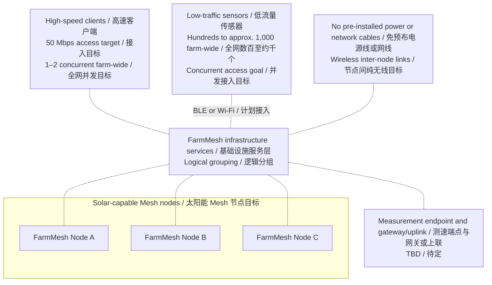
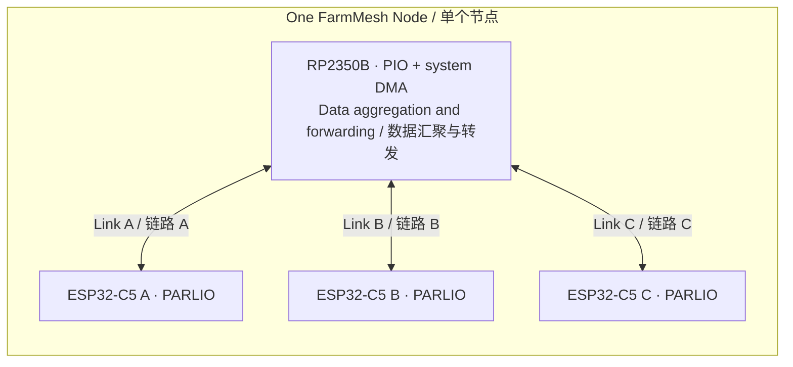

# FarmMesh Node

**草案 v0.3 — 产品目标与硬件架构**

[English](README.md) | 简体中文

[项目概述](#项目概述) · [功能与指标](#关键功能与性能目标) · [整体架构](#整体架构) · [内部接口](#候选内部接口) · [无线研究](#无线研究状态) · [待决策事项](#待决策事项) · [阶段规划](#阶段规划) · [联系与参与](#联系与参与) · [参考资料](#参考资料)

## 项目概述

FarmMesh Node 的目标是通过**可太阳能供电、无需预布电源线或网线的基础设施节点实现全农场覆盖**，同时提供局部按需高速接入，以及全域数百至约 1000 个低流量传感器的分布式接入。节点间计划采用纯无线互联。太阳能供电、储能及节点功耗预算仍待设计，不代表已具备全天候能源自足能力，也不排除网关／上联需求。

客户端接入性能的设计目标是：**连接某个 Mesh 节点后，按需获得 50 Mbps 有效吞吐**，希望农场任意位置在需要时都能使用。初始容量假设为**全农场同时 1–2 个高速客户端**，不是每个基础设施节点各 1–2 个，也不限制 Mesh 硬件节点数量或总客户端数量。这不要求所有位置同时达到 50 Mbps。测速端点、方向及条件仍为 TBD（待定）；不保证跨多跳 Mesh 或互联网端到端达到 50 Mbps。

基础设施节点还计划为**全农场数百至约 1000 个低流量、低功耗传感器提供 BLE 或 Wi-Fi 并发接入**，由多个 Mesh 节点分布式承载。这是需要容量验证的全网聚合规划目标，不是每个节点直连 1000 个 BLE 会话，也不表示所有传感器同时发包。终端能耗需求与基础设施的太阳能供电预算是两项不同约束，均不意味着转发骨干必须休眠。Wi-Fi 流量低本身不能证明功耗低，BLE/Wi-Fi 共存也需要验证。

每个基础设施节点包含 **1 颗 RP2350B 和 3 颗 ESP32-C5**。RP2350B 在节点内承担数据汇聚与转发角色，与每颗 C5 分别独立连接。另行保留的**每条板内链路初步目标 50 Mbps** 是硬件设计输入，不是已实现的用户吞吐，也不能据此认定接入服务目标可达；其方向口径及原始速率／有效载荷速率定义仍为 TBD。

项目按**先硬件、后软件**的顺序推进。当前仓库记录产品目标与架构草案，尚未完成原理图、PCB、接口程序或时序验证。覆盖、用户吞吐、终端容量、功耗和板内链路持续性能均未经实测。

## 关键功能与性能目标

**下列目标是计划中的需求，不是实测结果。** TBD 表示待确定；芯片资源事实与候选分配方案分别标注。

| 项目 | 目标或配置 | 状态与边界 |
| --- | --- | --- |
| 太阳能与部署 | 基础设施节点可太阳能供电；免预布电源线和网线；节点间纯无线互联 | 设计目标；太阳能配置、储能与节点功耗预算 TBD；能源自足未验证；网关／上联架构待定 |
| 全农场覆盖 | 整个农场范围内可无线接入 | 产品目标；面积、地形、距离、节点数量与布点 TBD |
| 按需高速接入 | 连接某个 Mesh 节点后获得 50 Mbps 客户端接入有效吞吐 | 设计目标；测速端点、方向与条件 TBD；不保证多跳或互联网端到端吞吐 |
| 高速客户端并发 | 全农场初步按 1–2 个规划 | 容量假设，未验证；不是每个 Mesh 节点的指标，也不是 Mesh 节点数或总客户端数上限 |
| 低流量并发接入 | 全农场数百至约 1000 个传感器，通过 BLE 或 Wi-Fi 接入 | 分布于多个节点的聚合规划目标；容量有上限且需验证；不是每节点 BLE 会话数或全体同时发包 |
| 单节点 BLE 容量 | 受 C5 控制器、主机协议栈／配置和无线调度约束 | 连接型或广播／扫描模式 TBD；角色及单节点上限待确认；不能将三颗 C5 容量直接相加作保证 |
| 终端能耗 | 支持低功耗终端运行 | 产品目标；活跃占空比、功耗预算与续航目标 TBD；太阳能基础设施的预算另行待定 |
| 节点组成 | 1 × RP2350B + 3 × ESP32-C5 | 已选架构组成；原理图与 PCB 尚未完成 |
| 独立板内链路 | 初步目标：每颗 C5–RP2350 链路 50 Mbps，三路不共享该指标 | 内部接口目标；方向、原始／载荷速率及满足用户服务目标所需的余量 TBD；未验证 |
| 板内接口 | PARLIO ↔ PIO，4 位 TX/RX 分离；两向时钟均由 C5 提供 | 候选方案；每路 12 根信号；程序、引脚映射与时序未验证 |
| RP2350B 资源 | 48 根 Bank0 GPIO；3 个 PIO／12 个状态机；每块共享 32 条指令；16 个系统 DMA 通道 | 芯片资源事实；下文的接口初步分配不代表已实现 |
| 无线角色与互联 | 每节点三颗 C5；Mesh 协议、无线角色／信道、网关／上联 TBD | 架构待决策；未保证 BLE/Wi-Fi 共存性能或互联网吞吐 |

## 整体架构

### 网络概念

下图区分终端接入与 Mesh 基础设施。虚线表示计划中的服务关系或节点归属，不表示物理无线连接或数据包路径；服务层方框是逻辑分组，不是中心设备。节点间拓扑、无线角色与 Mesh 协议仍待确定，测速端点及网关／上联边界也为 TBD。

### 单个节点内部

每条连线表示一路独立的内部数据链路。时钟和 VALID 的方向在后面的接口表中单独定义，此图箭头不表示时钟来源。

此图未指定三颗 ESP32-C5 的无线角色、信道或与其他节点的连接关系。

### 无线共存边界

Espressif 文档说明共享射频资源采用时分与优先级仲裁；当前 C5 共存表将 Wi-Fi SoftAP Connecting/Connected 与 BLE Scan/Advertising/Connected 的组合标为 C1（支持，但性能不稳定）。若让同一颗 C5 同时承担 Wi-Fi AP 和 BLE 角色，需要验证这一约束；这并不证明三芯片节点无法实现产品目标。无线角色分配及共存表现应结合选定 SDK 和实际场景验证。终端并发服务不等于单颗 C5 的多个无线功能可独立、同时满负荷工作。参见[官方射频共存指南](https://docs.espressif.com/projects/esp-idf/en/stable/esp32c5/api-guides/coexist.html#supported-coexistence-scenario-for-esp32-c5)。

单节点 BLE 容量存在与实现有关的上限，并非 BLE 规范对所有实现统一规定一个固定连接数。C5 控制器与 NimBLE 主机协议栈分别提供连接数配置，见[官方配置参考](https://docs.espressif.com/projects/esp-idf/en/stable/esp32c5/api-reference/kconfig-reference.html#config-bt-le-max-connections)。连接型接入和无连接广播／扫描属于不同的 [BLE 角色与拓扑](https://docs.espressif.com/projects/esp-idf/en/stable/esp32c5/api-guides/ble/get-started/ble-introduction.html#bluetooth-le-network-topology)，扫描广播不能按持续连接计数；广播／扫描模式可承载的终端数量需要单独验证。选定接入模式与三颗 C5 的角色后再确认单节点容量，不能直接把三颗芯片的配置上限相加作为节点容量。

## 候选内部接口

当前候选为 **ESP32-C5 PARLIO ↔ RP2350 PIO**，每方向 4 位，TX/RX 使用分开的数据线。该方案旨在支持同时双向传输，尚未冻结或实现验证。

**每颗 C5 提供对应链路两个方向的时钟；RP2350 PIO 在两个方向均跟随外部时钟**，包括 RP2350 向 C5 发送数据的方向。

| 数据传输方向 | DATA | 时钟 | VALID |
| --- | --- | --- | --- |
| C5 → RP2350 | 4 根，C5 → RP | C5 TX CLK → RP | C5 TX VALID → RP |
| RP2350 → C5 | 4 根，RP → C5 | C5 RX CLK → RP | RP VALID → C5 |

**每路共 12 根信号**：8 DATA、2 CLK、2 VALID；三路共 **36 根信号**，另需共同地参考。尚未确定最终引脚分配。

PARLIO 具有独立 TX/RX 单元。若改用共享数据线的半双工方案，必须明确处理输出使能、三态和换向；不能把 PARLIO 当作可自动换向的共享总线，也不能把禁用 TX 等同于输出自动进入高阻态。

### 初步资源预算

| RP2350B 资源 | 芯片资源 | 三路接口初步估计 |
| --- | --- | --- |
| Bank0 GPIO，QFN80 封装 | 48 根 | 接口占 36 根；其他用途分配前余 12 根 |
| PIO 状态机 | 3 个 PIO，共 12 个 | 共 6 个：每路 RX/TX 各 1 个 |
| 系统 DMA 通道 | 16 个 | 共 6 个：每路每方向 1 个 |
| PIO 指令存储 | 每个 PIO 共享 32 条指令 | 程序大小尚未确定 |

以上是资源估计，不代表已有可运行的 PIO 程序或经验证的时序设计。每个 PIO 有一个 32 GPIO 窗口，通过 GPIOBASE 选择 0 或 16 起点；最终引脚映射和指令占用仍须校核。专用 QSPI 存储引脚、USB、SWD 不占用上述 48 根 Bank0 GPIO，具体开发板的可用引脚应另行核查。具有 30 根 GPIO 的 RP2350A 无法容纳这套 36 根信号方案。

### 处理分工与时序边界

- **CPU**：初始化、缓冲准备、事务协调与异常管理。
- **PIO**：在 C5 提供的时钟下执行逐拍采样和输出时序。
- **系统 DMA**：在 PIO FIFO 与 RP2350 SRAM 之间逐块搬运，目标是避免 CPU 逐字节复制。

C5 PARLIO RX 文档描述了接收时钟输出及 VALID 接收门控。数据到来前必须准备好 C5 RX/GDMA 接收事务，VALID 本身不能创建接收事务。RP 需要准备首拍数据并正确驱动 VALID；启动、结束、采样边沿与门控时序仍需具体设计和验证。

帧边界、DMA 重装和持续运行机制也尚待设计。仅配置环形地址不能保证无限运行，本草案不承诺传输管理完全无需 CPU。

## 无线研究状态

[无线链路研究笔记](docs/wireless-link-research.zh-CN.md) 记录了 **2026-09-22** 的核查、官方来源、特定版本二进制观察及 MTU/MSS 约束。**尚未选定无线传输方案。** 上述客户端接入目标与板内硬件候选方案保持不变。

| 主题 | 当前结论 | 状态与边界 |
| --- | --- | --- |
| WDS／四地址桥接 | 所核查文档／API 中未确认 C5 可直接启用的公开支持 | 不代表硬件绝对不可能实现 |
| ESP-NOW 与公开 raw 发送 | 帧与载荷长度口径不同；均不能作为本项目 50 Mbps 有效吞吐的证据 | 研究候选；持续吞吐未验证 |
| 速率与功率控制 | 公开接口可按 peer 配置 ESP-NOW 速率，并按 C5 设置 Wi-Fi 最大发射功率上限 | 已文档化的控制接口；未确认可直接启用的 ESP-NOW 自动速率工具，自定义自适应仍是后续工作 |
| AP+STA + proxy ARP | 当前不推进 | 项目方向选择，不是技术不可行结论 |

## 待决策事项

1. 明确客户端接入 Mesh 节点后的 50 Mbps 测试：测速端点、上／下行方向及条件。全农场先按 1–2 个高速客户端并发规划，多跳及互联网吞吐不在任何已确定的性能保证内。
2. 单独定义每条板内链路的 50 Mbps：单向、收发合计或每方向；原始速率还是有效载荷速率；以及支撑用户服务目标所需的容量余量。
3. 确认三路 PIO 可行性、时钟与时序约束、GPIO 映射、指令预算及必要的 CPU 参与程度；定义首拍就绪、VALID 行为、接收事务预备、帧边界和 DMA 重装机制。
4. 验证全农场数百至约 1000 个低流量传感器的规划目标。选择连接型 BLE 或广播／扫描角色，确定单节点上限，并定义活跃占空比、流量、延迟与终端能耗目标。无线角色／信道与 BLE/Wi-Fi 共存仍待验证。
5. 设计免预布电源线或网线部署所需的太阳能供电、储能与基础设施功耗预算；后续确定 Mesh 协议与路由、天线、覆盖面积／地形与部署、网关／上联、环境防护和完整 BOM。

当前阶段记录上述产品需求，实施讨论仍聚焦硬件接口、资源及 PIO、系统 DMA、CPU 的分工。固件实现、软件路由与系统优化留待后续。

## 阶段规划

| 阶段 | 范围 | 状态 |
| --- | --- | --- |
| 1 | 硬件接口与架构确认 | 当前：讨论草案 |
| 2 | 原理图与 PCB | 待架构决策 |
| 3 | 上电及接口验证 | 待硬件完成；包含必要的测试固件 |
| 4 | 应用固件与 Mesh 集成 | 硬件验证后推进 |

## 联系与参与

对 FarmMesh Node 感兴趣？欢迎通过本仓库的 [GitHub Issues](https://github.com/chinawrj/FarmMesh-Node/issues) 交流需求、硬件设计或参与方式，也可以访问项目发起人的 [GitHub 主页](https://github.com/chinawrj)。

## 参考资料

后续设计复核所用官方资料：

- [RP2350 数据手册](https://datasheets.raspberrypi.com/rp2350/rp2350-datasheet.pdf)：GPIO、PIO 与系统 DMA 资源。
- [ESP32-C5 数据手册](https://documentation.espressif.com/esp32-c5_datasheet_en.html)及[技术参考手册](https://documentation.espressif.com/esp32-c5_technical_reference_manual_en.pdf)：芯片与外设细节。
- [ESP32-C5 PARLIO RX 驱动](https://docs.espressif.com/projects/esp-idf/en/stable/esp32c5/api-reference/peripherals/parlio/parlio_rx.html)：接收时钟、VALID 与事务配置。
- [ESP32-C5 PARLIO TX 驱动](https://docs.espressif.com/projects/esp-idf/en/stable/esp32c5/api-reference/peripherals/parlio/parlio_tx.html)：发送配置与运行。
- [ESP32-C5 射频共存](https://docs.espressif.com/projects/esp-idf/en/stable/esp32c5/api-guides/coexist.html)：角色组合支持情况及共享射频调度约束。

C5 不同资料对最大全双工位宽的表述差异仍需核对。本草案仅讨论每方向 4 位候选方案，不对更宽的全双工配置作结论。ESP-IDF 的 `stable` 链接会变化，确定实现基线时应记录选定的 SDK 和文档版本。
