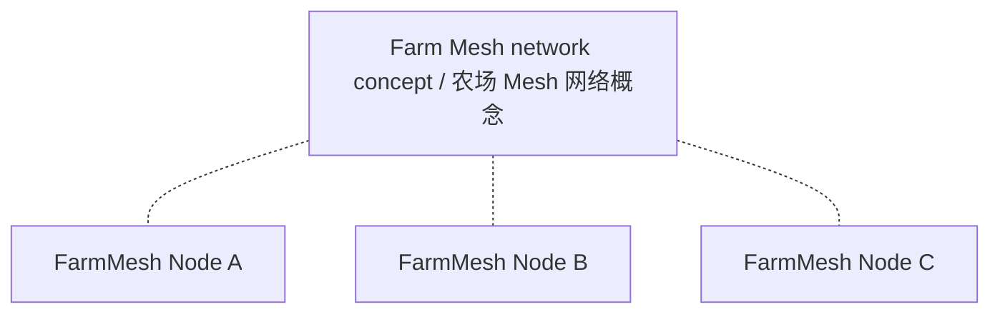
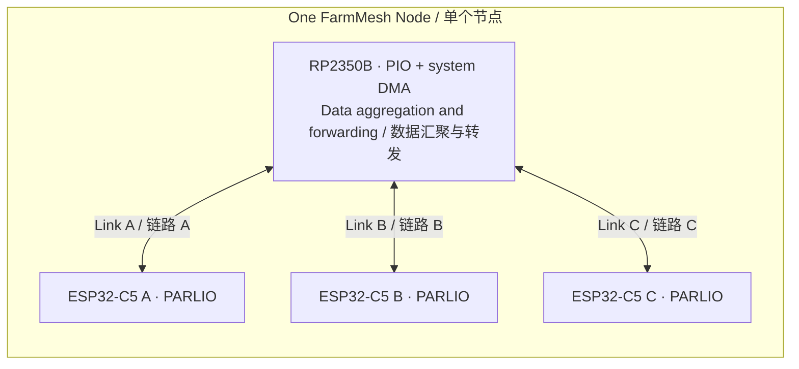

# FarmMesh Node

**草案 v0.1 — 硬件架构讨论**

[English](README.md) | 简体中文

[项目概述](#项目概述) · [整体架构](#整体架构) · [内部接口](#候选内部接口) · [待决策事项](#待决策事项) · [阶段规划](#阶段规划) · [参考资料](#参考资料)

## 项目概述

FarmMesh Node 是面向农场大范围部署的 Mesh 网络硬件节点项目。每个节点包含 **1 颗 RP2350B 和 3 颗 ESP32-C5**，多个节点组成目标网络。三路内部互联是节点的一部分，不是整个项目的定义。

RP2350B 在节点内承担数据汇聚与转发角色。每颗 ESP32-C5 分别通过独立内部链路连接 RP2350B，**每路目标为 50 Mbps（兆比特每秒）**，并非三路共享 50 Mbps。该目标指单向、收发合计还是每方向各 50 Mbps，尚待确定；它也不代表实际无线吞吐。

项目按**先硬件、后软件**的顺序推进。当前仓库记录架构草案，尚未完成原理图、PCB、接口程序或时序验证，也未证明能够持续稳定运行在 50 Mbps。

## 整体架构

### 网络概念

下图虚线表示节点参与目标网络，不代表具体无线连接，也不表示存在中心网络设备。节点间拓扑、无线角色与 Mesh 协议仍待确定。

### 单个节点内部

每条连线表示一路独立的内部数据链路。时钟和 VALID 的方向在后面的接口表中单独定义，此图箭头不表示时钟来源。

此图未指定三颗 ESP32-C5 的无线角色、信道或与其他节点的连接关系。

## 候选内部接口

当前候选为 **ESP32-C5 PARLIO ↔ RP2350 PIO**，每方向 4 位，TX/RX 使用分开的数据线。该方案旨在支持同时双向传输，尚未冻结或实现验证。

**每颗 C5 提供对应链路两个方向的时钟；RP2350 PIO 在两个方向均跟随外部时钟**，包括 RP2350 向 C5 发送数据的方向。

| 数据传输方向 | DATA | 时钟 | VALID |
| --- | --- | --- | --- |
| C5 → RP2350 | 4 根，C5 → RP | C5 TX CLK → RP | C5 TX VALID → RP |
| RP2350 → C5 | 4 根，RP → C5 | C5 RX CLK → RP | RP VALID → C5 |

**每路共 12 根信号**：8 DATA、2 CLK、2 VALID；三路共 **36 根信号**，另需共同地参考。尚未确定最终引脚分配。

PARLIO 具有独立 TX/RX 单元。若改用共享数据线的半双工方案，必须明确处理输出使能、三态和换向；不能把 PARLIO 当作可自动换向的共享总线，也不能把禁用 TX 等同于输出自动进入高阻态。

### 初步资源预算

| RP2350B 资源 | 芯片资源 | 三路接口初步估计 |
| --- | --- | --- |
| Bank0 GPIO，QFN80 封装 | 48 根 | 接口占 36 根；其他用途分配前余 12 根 |
| PIO 状态机 | 3 个 PIO，共 12 个 | 共 6 个：每路 RX/TX 各 1 个 |
| 系统 DMA 通道 | 16 个 | 共 6 个：每路每方向 1 个 |
| PIO 指令存储 | 每个 PIO 共享 32 条指令 | 程序大小尚未确定 |

以上是资源估计，不代表已有可运行的 PIO 程序或经验证的时序设计。每个 PIO 有一个 32 GPIO 窗口，通过 GPIOBASE 选择 0 或 16 起点；最终引脚映射和指令占用仍须校核。专用 QSPI 存储引脚、USB、SWD 不占用上述 48 根 Bank0 GPIO，具体开发板的可用引脚应另行核查。具有 30 根 GPIO 的 RP2350A 无法容纳这套 36 根信号方案。

### 处理分工与时序边界

- **CPU**：初始化、缓冲准备、事务协调与异常管理。
- **PIO**：在 C5 提供的时钟下执行逐拍采样和输出时序。
- **系统 DMA**：在 PIO FIFO 与 RP2350 SRAM 之间逐块搬运，目标是避免 CPU 逐字节复制。

C5 PARLIO RX 文档描述了接收时钟输出及 VALID 接收门控。数据到来前必须准备好 C5 RX/GDMA 接收事务，VALID 本身不能创建接收事务。RP 需要准备首拍数据并正确驱动 VALID；启动、结束、采样边沿与门控时序仍需具体设计和验证。

帧边界、DMA 重装和持续运行机制也尚待设计。仅配置环形地址不能保证无限运行，本草案不承诺传输管理完全无需 CPU。

## 待决策事项

1. 明确每路 50 Mbps 的方向口径。
2. 确认三路 PIO 接口可行性、时钟与时序约束、GPIO 映射、指令预算及必要的 CPU 参与程度。
3. 定义首拍就绪、VALID 行为、接收事务预备、帧边界和 DMA 重装机制。
4. 后续确定无线角色与信道、Mesh 协议与路由、天线、覆盖指标、供电、环境防护和完整 BOM。

当前首先讨论硬件接口可行性及 PIO、系统 DMA、CPU 的分工；无线吞吐与软件路由属于后续议题。

## 阶段规划

| 阶段 | 范围 | 状态 |
| --- | --- | --- |
| 1 | 硬件接口与架构确认 | 当前：讨论草案 |
| 2 | 原理图与 PCB | 待架构决策 |
| 3 | 上电及接口验证 | 待硬件完成；包含必要的测试固件 |
| 4 | 应用固件与 Mesh 集成 | 硬件验证后推进 |

## 参考资料

后续设计复核所用官方资料：

- [RP2350 数据手册](https://datasheets.raspberrypi.com/rp2350/rp2350-datasheet.pdf)：GPIO、PIO 与系统 DMA 资源。
- [ESP32-C5 数据手册](https://documentation.espressif.com/esp32-c5_datasheet_en.html)及[技术参考手册](https://documentation.espressif.com/esp32-c5_technical_reference_manual_en.pdf)：芯片与外设细节。
- [ESP32-C5 PARLIO RX 驱动](https://docs.espressif.com/projects/esp-idf/en/stable/esp32c5/api-reference/peripherals/parlio/parlio_rx.html)：接收时钟、VALID 与事务配置。
- [ESP32-C5 PARLIO TX 驱动](https://docs.espressif.com/projects/esp-idf/en/stable/esp32c5/api-reference/peripherals/parlio/parlio_tx.html)：发送配置与运行。

C5 不同资料对最大全双工位宽的表述差异仍需核对。本草案仅讨论每方向 4 位候选方案，不对更宽的全双工配置作结论。ESP-IDF 的 `stable` 链接会变化，确定实现基线时应记录选定的 SDK 和文档版本。
